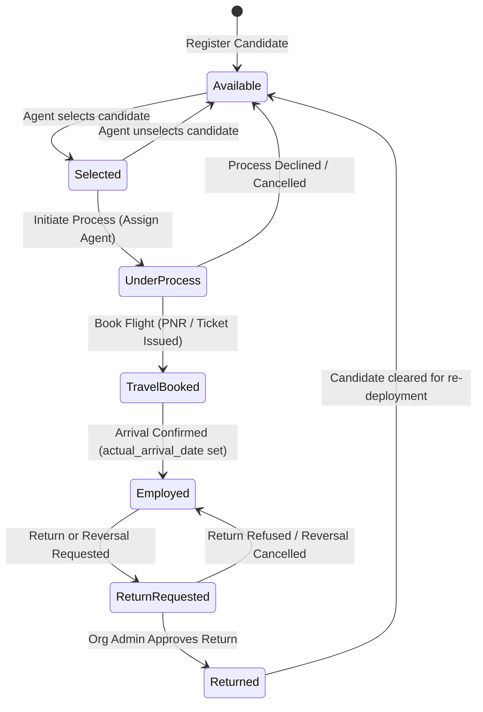

# Agent Handoff & Architecture Blueprint: Employment Portal

> **Target Audience**: Autonomous AI coding agents and engineers picking up work on this codebase.  
> **Status**: Verified operational — All 80 backend Django tests & 75 frontend Vitest suites passing (October 2026).  
> **Location**: [`docs/AGENT_HANDOFF.md`](file:///D:/Projects/Employment-Portal/docs/AGENT_HANDOFF.md)

---

## 1. Executive Summary & Core Mission

The **Employment Portal** is a production-grade multi-tenant SaaS platform built for candidate recruitment, overseas workforce deployment, agency commission settlements, document OCR scanning, and travel logistics.

### Critical Invariants to Preserve:
1. **Terminology Separation (Tier 1 Architecture)**:
   - **User Interface & Routing**: Exclusively uses **"Candidate(s)"** (e.g., `/dashboard/candidates/*`, [`CandidateCard`](file:///D:/Projects/Employment-Portal/frontend/src/components/candidates/CandidateCard.jsx), [`candidatesService.js`](file:///D:/Projects/Employment-Portal/frontend/src/services/candidatesService.js)).
   - **Database & Backend Models**: Preserves **"Employee"** models and table names (e.g., [`Employee`](file:///D:/Projects/Employment-Portal/backend/portal/app/models.py#L424), `EmployeeSelection`, `EmployeeReturnRequest`) to guarantee 100% data integrity and zero downtime. All frontend candidate files are structured as direct re-export wrappers or consumers of underlying employee APIs.
2. **Authentication Model**:
   - Django session cookies (`sessionid`) with mandatory CSRF tokens (`csrftoken`).
   - Do **NOT** introduce JWT tokens unless explicitly instructed; all frontend API calls use [`apiFetch`](file:///D:/Projects/Employment-Portal/frontend/src/api/client.js) which automatically attaches CSRF headers and credentials.
3. **Multi-Tenancy & Licensing Enforcement**:
   - Every user belongs to an [`Organization`](file:///D:/Projects/Employment-Portal/backend/portal/app/models.py#L182).
   - Read-only mode and seat quotas are actively enforced via [`licensing.py`](file:///D:/Projects/Employment-Portal/backend/portal/app/licensing.py) and DRF permission classes.

---

## 2. High-Level Architecture Diagram

```mermaid
flowchart TD
    subgraph Client ["Frontend (React 19 + Vite 8)"]
        UI["UI Layer (Vanilla CSS 00-10)"]
        AuthContext["AuthContext (Session + CSRF)"]
        CandidatesUI["Candidates Layout & Sub-pages"]
        CommissionsUI["Commissions & Settlements Page"]
        HardwareScan["Asprise ScannerJS Client"]
        ExportPDF["jsPDF CV Generator"]
    end

    subgraph Server ["Backend (Django 6.0.3 + DRF 3.17)"]
        API["REST Endpoints (/api/...)"]
        Licensing["Licensing & Quota Guard"]
        AuditLog["Audit Logger"]
        SyncEngine["Ed25519 Signed Sync Engine"]
        WorkflowEng["Candidate State Machine"]
        CommissionEng["Commission & Penalty Engine"]
    end

    subgraph DataStore ["Persistence & External Services"]
        DB[("PostgreSQL / Neon DB")]
        PaddleOCR["PaddleOCR Microservice (:8766)"]
        TravelAPI["Travel Provider Service (:8001)"]
        CompanyHQ["Company Control Center (Central SaaS)"]
    end

    UI --> AuthContext
    CandidatesUI --> API
    CommissionsUI --> API
    HardwareScan --> UI
    ExportPDF --> UI

    API --> Licensing
    API --> AuditLog
    API --> WorkflowEng
    API --> CommissionEng

    API <--> DB
    API <-->|Signed HTTP (Ed25519)| CompanyHQ
    API <-->|HTTP POST /api/ocr| PaddleOCR
    API <-->|HTTP Proxy| TravelAPI
```

---

## 3. Tech Stack & Environment Matrix

| Layer | Technology | Details / Versions |
| :--- | :--- | :--- |
| **Backend Framework** | Django 6.0.3 + DRF 3.17 | Python 3.13 (`portal/manage.py`) |
| **Database** | PostgreSQL 16+ / Neon DB | Local port: `5432`, DB: `employment_portal_db`, user: `postgres` |
| **Database Fallback** | SQLite 3 | Activated by `USE_SQLITE=True` in [`.env`](file:///D:/Projects/Employment-Portal/backend/portal/.env) |
| **Frontend Framework** | React 19.2.4 + React Router 7.13.1 | Single-Page Application via Vite 8.0.1 |
| **Frontend Tooling** | Vite 8 + Vitest 5 + ESLint 9 | Native ESM config loader |
| **Security / Crypto** | Python `cryptography` | Ed25519 signature validation for server-to-server sync |
| **Physical Hardware** | Asprise ScannerJS | TWAIN scanner integration for direct document ingest |
| **OCR Extraction** | PaddleOCR Sidecar | External HTTP container on `http://127.0.0.1:8766` |
| **PDF Generation** | `jspdf` 4.2.1 + `jspdf-autotable` | Client-side dynamic CV compilation |

---

## 4. Local Development & Operational Runbook

### A. Environment Files
- **Backend**: [`backend/portal/.env`](file:///D:/Projects/Employment-Portal/backend/portal/.env)
  - `DEBUG=true`
  - `DB_NAME=employment_portal_db`, `DB_USER=postgres`, `DB_PASSWORD=admin`, `DB_HOST=127.0.0.1`, `DB_PORT=5432`
  - Comment out `DATABASE_URL` during local dev so it does not connect to remote Neon DB.
- **Frontend**: [`frontend/.env`](file:///D:/Projects/Employment-Portal/frontend/.env)
  - `VITE_API_BASE_URL=` (leave blank to proxy `/api` to Django port 8000).

### B. Standard Development Commands (PowerShell / Windows)

```powershell
# 1. Run Backend Server
cd D:\Projects\Employment-Portal\backend\portal
python manage.py runserver 8000

# 2. Run Frontend Dev Server
cd D:\Projects\Employment-Portal\frontend
npm.cmd run dev

# 3. Run Backend Test Suite (Ran 80 tests in ~83s - ALL PASS)
cd D:\Projects\Employment-Portal\backend\portal
python manage.py test app

# 4. Run Frontend Vitest Suite (75 tests - ALL PASS)
cd D:\Projects\Employment-Portal\frontend
npm.cmd run test

# 5. Build Frontend for Production
cd D:\Projects\Employment-Portal\frontend
npm.cmd run build
```

> [!NOTE]
> On Windows PowerShell, avoid executing `npm` directly if execution policies block `npm.ps1`; always execute `npm.cmd`.

---

## 5. Directory Map & Key Files

```text
Employment-Portal/
├── backend/
│   └── portal/
│       ├── app/
│       │   ├── models.py                  # Core models: Organization, Profile, Employee, CommissionRequest, etc.
│       │   ├── employee_views/            # Candidate CRUD, workflow, travel, and returns
│       │   │   ├── crud_views.py          # Create, list, retrieve, update, delete candidates
│       │   │   ├── workflow_views.py      # Select, process start/decline, arrival confirm
│       │   │   ├── travel_views.py        # Travel booking & travel confirmation
│       │   │   ├── return_views.py        # Return & reversal request endpoints
│       │   │   └── helpers.py             # Permission checkers & candidate scope helpers
│       │   ├── commission_views.py        # Commissions, settlements, regulation requests & refunds
│       │   ├── licensing.py               # Organization quota & read-only access engine
│       │   ├── employee_ocr.py            # PaddleOCR HTTP client
│       │   ├── travel_service.py          # Travel provider microservice client
│       │   ├── sync_security.py           # Ed25519 signature generator & validator
│       │   ├── serializers/               # DRF serializers (candidate, travel, commission, user)
│       │   ├── urls.py                    # API route definitions
│       │   └── tests.py                   # Automated Django test suite (80 comprehensive test cases)
│       ├── portal/                        # Settings, WSGI, ASGI
│       │   ├── settings.py                # Database, CORS, CSRF, auth settings
│       │   └── urls.py                    # Root URL router
│       └── manage.py
├── frontend/
│   ├── src/
│   │   ├── App.jsx                        # React Router 7 setup, routes, lazy loading
│   │   ├── api/client.js                  # apiFetch with CSRF token & credentials
│   │   ├── components/
│   │   │   ├── candidates/                # Modern re-exports for candidate components
│   │   │   ├── employees/                 # Core implementation of candidate cards, listings, modals
│   │   │   │   ├── EmployeeCard.jsx       # Candidate card with stage tags and quick actions
│   │   │   │   ├── EmployeeReviewModal.jsx# Complete dossier, documents, travel & return modal
│   │   │   │   ├── EmployeeInitiateProcessModal.jsx # Lightweight agent process assignment modal
│   │   │   │   └── EmployeesListingView.jsx# Table and card grid view engine
│   │   │   └── layout/DashboardLayoutSidebar.jsx # Navigation sidebar
│   │   ├── pages/
│   │   │   ├── candidates/                # Sub-route pages (re-exports)
│   │   │   ├── employees/                 # Real implementations: List, Register, UnderProcess, Employed, Returned
│   │   │   ├── CommissionsPage.jsx        # Agency commissions, settlements, receipts, regulation requests
│   │   │   ├── TravelPage.jsx             # Flights search & passenger bookings
│   │   │   ├── NotificationsPage.jsx      # Notifications & reminder alarms
│   │   │   ├── ProfilesPage.jsx           # Agent & staff management
│   │   │   └── SettingsPage.jsx           # Theme, density & system preferences
│   │   ├── services/
│   │   │   ├── candidatesService.js       # Candidate API re-export
│   │   │   ├── employeesService.js        # Core candidate HTTP calls
│   │   │   ├── notificationsService.js    # In-app notifications API
│   │   │   └── aspriseScannerService.js   # TWAIN scanner hardware interface
│   │   ├── utils/
│   │   │   ├── candidateHelpers.js        # Re-export of employeeHelpers
│   │   │   ├── employeeHelpers.js         # State machine calculators, workflow transitions, photo URL
│   │   │   └── commissionsHelpers.js      # Settlement calculations, balance derivations
│   │   └── styles/                        # Modular numbered CSS system (00 to 10)
│   ├── package.json
│   └── vite.config.js
└── docs/                                  # Architectural & Handoff documentation
    ├── AGENT_HANDOFF.md                   # This file (master agent blueprint)
    ├── CANDIDATE_RENAMING_HANDOFF.md      # UI vs DB naming rationale
    └── Architecture Diag.md               # Mermaid system diagrams
```

---

## 6. Domain Subsystems & Business Logic

### A. Candidate Lifecycle State Machine
Candidates transition through explicit states tracked in [`Employee`](file:///D:/Projects/Employment-Portal/backend/portal/app/models.py#L424) and evaluated in [`employeeHelpers.js`](file:///D:/Projects/Employment-Portal/frontend/src/utils/employeeHelpers.js):



- **Arrival Confirmation**: When travel departs, either the agent or organization confirms arrival via `POST /api/employees/{id}/confirm-arrival/`. This sets `actual_arrival_date` and transitions the candidate into `Employed` status.
- **Return Requests**: If candidate returns early, a return request is submitted with reasons, flight docs, and evidence attachments.
- **Reversal Requests**: An agent or user can request reversal of an erroneous status, which must be approved or refused by organization admins.

### B. Commissions, Settlements & Financial Engine
Located in [`app/commission_views.py`](file:///D:/Projects/Employment-Portal/backend/portal/app/commission_views.py) and [`CommissionsPage.jsx`](file:///D:/Projects/Employment-Portal/frontend/src/pages/CommissionsPage.jsx):

1. **[`CommissionRequest`](file:///D:/Projects/Employment-Portal/backend/portal/app/models.py#L858)**:
   - Created when candidate is employed / departs.
   - Calculates commission based on agent rate (`Profile.agent_commission` or `AgentOffice.commission`).
2. **[`CommissionSettlement`](file:///D:/Projects/Employment-Portal/backend/portal/app/models.py#L909)**:
   - Groups one or more commission requests into a payout settlement.
   - Supports uploading up to 3 bank/wire receipt files (`receipt_file_1`, `receipt_file_2`, `receipt_file_3`).
   - Automatically deducts outstanding **Refund Records**.
3. **[`RefundRecord`](file:///D:/Projects/Employment-Portal/backend/portal/app/models.py#L1037)**:
   - Triggered when an employed candidate is returned early (e.g., within contractual warranty window).
   - Tracks `refund_amount`, `deducted_amount`, and `remaining_balance`.
   - Outstanding balances are automatically subtracted from subsequent settlements.
4. **[`RegulationSettlementRequest`](file:///D:/Projects/Employment-Portal/backend/portal/app/models.py#L983)**:
   - Monthly allowance and regulatory compensation claims (`month_period` formatted as `YYYY-MM`).
5. **[`PenaltyRecord`](file:///D:/Projects/Employment-Portal/backend/portal/app/models.py#L1101)**:
   - Disciplinary or breach penalties assigned to either an `agent` or `organization`.

### C. Role-Based Access Control (RBAC)

| Role | Capabilities | User Scope |
| :--- | :--- | :--- |
| `superadmin` | Unrestricted platform control, subscription plan editing, system settings | Platform / Root |
| `admin` | Full organization management, user creation, return approval, settlement payouts | Organization |
| `staff` | Candidate registration, document uploads, flight booking, process management | Organization |
| `agent` | Select available candidates, upload visa/medical, confirm arrival, track commissions | Agent-Side |
| `customer` | View placed candidates, request employee returns | Customer-Side |

Scope is computed dynamically via [`get_employee_user_scope(user, organization)`](file:///D:/Projects/Employment-Portal/backend/portal/app/employee_views/helpers.py#L20).

---

## 7. Database Migrations Status

The database contains **28 applied migrations** in the `app` namespace.
- Latest applied:
  - [`0027_alter_employeereturnrequest_status_and_more.py`](file:///D:/Projects/Employment-Portal/backend/portal/app/migrations/0027_alter_employeereturnrequest_status_and_more.py)
  - [`0028_employee_actual_arrival_date_and_more.py`](file:///D:/Projects/Employment-Portal/backend/portal/app/migrations/0028_employee_actual_arrival_date_and_more.py)
- When adding fields to models in `models.py`:
  ```powershell
  cd D:\Projects\Employment-Portal\backend\portal
  python manage.py makemigrations
  python manage.py migrate
  ```

---

## 8. Verified Codebase Health & Priority Action Items

Both test suites are **100% green**:
- Backend: `80 passed` (Django `test app`)
- Frontend: `98 passed` (Vitest across 10 test suites)
- Frontend Build: `vite build` succeeds in ~490ms with 0 errors / 0 warnings.

### Minor Technical Debt Items Identified for Resolution:
1. **Service Aliases Missing in Frontend**:
   - In [`EmployeeReviewModal.jsx`](file:///D:/Projects/Employment-Portal/frontend/src/components/employees/EmployeeReviewModal.jsx#L447), `employeesService.approveReturn` & `refuseReturn` are called. Alias these in [`employeesService.js`](file:///D:/Projects/Employment-Portal/frontend/src/services/employeesService.js):
     ```javascript
     export const approveReturn = approveEmployeeReturnRequest
     export const refuseReturn = refuseEmployeeReturnRequest
     ```
   - In [`NotificationsPage.jsx`](file:///D:/Projects/Employment-Portal/frontend/src/pages/NotificationsPage.jsx#L422), `deleteNotification` is called. Export a fallback in [`notificationsService.js`](file:///D:/Projects/Employment-Portal/frontend/src/services/notificationsService.js):
     ```javascript
     export async function deleteNotification(id) {
       return patchNotification(id, { read: true })
     }
     ```
2. **React Rules of Hooks Ordering**:
   - In [`EmployeesLayout.jsx`](file:///D:/Projects/Employment-Portal/frontend/src/pages/employees/EmployeesLayout.jsx#L62-L80), `useMemo` hooks are called *after* `if (!canManageEmployees) return <Navigate ... />`. Move the hooks above the conditional return to maintain consistent render hook counts.
3. **ESLint Vendor Ignore**:
   - Add `public/**` to `ignores` in [`eslint.config.js`](file:///D:/Projects/Employment-Portal/frontend/eslint.config.js) to avoid linting Dynamsoft vendor scripts.

---

## 9. Next Agent Prompt Template

When initiating another agent, use this exact prompt:

```text
Please read the comprehensive handoff and architecture guide in Docs/AGENT_HANDOFF.md. 
The environment is verified (Python 3.13 + Django 6.0.3 backend with PostgreSQL, React 19 + Vite frontend).
All 80 backend tests and 75 vitest tests are passing.
Please follow the guidelines, terminology rules (Candidate on UI, Employee in DB), and session-based auth model documented in that file.
```
