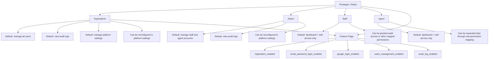

# Privileges Flow

```mermaid
flowchart TD
  A["Privileges / Roles"]

  A --> SA["Superadmin"]
  A --> AD["Admin"]
  A --> ST["Staff"]
  A --> CU["Agent"]

  SA --> SA1["Default: manage all users"]
  SA --> SA2["Default: view audit logs"]
  SA --> SA3["Default: manage platform settings"]
  SA --> SA4["Can be reconfigured in platform settings"]

  AD --> AD1["Default: manage staff and agent accounts"]
  AD --> AD2["Default: view audit logs"]
  AD --> AD3["Can be reconfigured in platform settings"]

  ST --> ST1["Default: dashboard + self-service only"]
  ST --> ST2["Can be granted audit access or other mapped permissions"]

  CU --> CU1["Default: dashboard + self-service only"]
  CU --> CU2["Can be expanded later through role-permission mapping"]

  A --> B["Feature Flags"]
  B --> B1["registration_enabled"]
  B --> B2["email_password_login_enabled"]
  B --> B3["google_login_enabled"]
  B --> B4["users_management_enabled"]
  B --> B5["audit_log_enabled"]

  SA --> B
```
